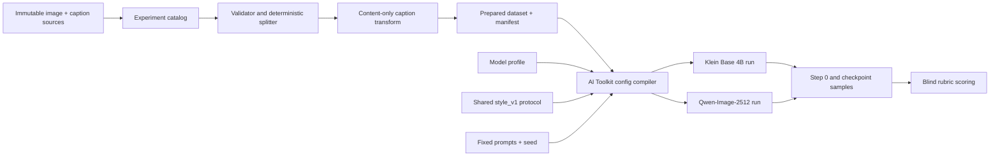

# Training architecture

## Goal

Measure how dataset provenance and composition change a base model's learned
representation of the Saturnia visual style. The primary unit of comparison is
the dataset variant *within* one base-model family. Cross-family Klein/Qwen
comparisons are secondary because the models require different inference
settings.



## Layers

### 1. Immutable sources

`images/` and the accepted `synthetic/*` folders are local, unpublished inputs and remain untouched. The rejected
folder is never reached by any experiment definition. Pairing is by filename
stem (`foo.png` + `foo.txt`). Preparation fails on a missing caption or an
unreadable image rather than silently reducing a run.

### 2. Experiment catalog

Files in `configs/experiments/` describe only the independent variable: which
source folders are included. They also own the trigger, caption policy, and
split seed. Adding an experiment is data-only; no Python edit is required.

The first six experiments form a progression:

1. Real/reference images only.
2. Synthetic core only.
3. Synthetic core plus expanded color.
4. Reference plus both organic synthetic sets.
5. Every accepted synthetic set.
6. Everything accepted.

This separates synthetic imitation from reference fidelity, then tests whether
color and humanoid augmentation broaden or dilute the learned style.

### 3. Dataset preparation

`saturnia_lora.dataset` scans and hashes each file, reads PNG/JPEG dimensions,
and applies a deterministic holdout inside each source. A source's ranked split
depends only on its relative path, filename, and `split_seed`, so adding another
source cannot reshuffle it.

Training images are symlinked into `.runs/datasets/<experiment>/train/`; if the
filesystem cannot create symlinks, hard links are used. Generated `.txt`
captions are regular files. Prefixing the source path in prepared filenames
prevents collisions such as `images/01` vs `synthetic/core_organic/01`.

Every manifest records paths, dimensions, hashes, split, and exact transformed
caption. Duplicate hashes are reported. This is the dataset evidence needed to
explain a run months later.

### 4. Caption treatment

The repository's captions have a consistent structure:

```text
SATURNIA_STYLE, <content sentence>. <explicit style sentence>.
```

The default `content_only` policy emits:

```text
SATURNIA_STYLE. <content sentence>.
```

This follows BFL's style-training guidance to caption visible content but omit
the target style, forcing the shared trigger to carry graphite, hatching,
paper, wash, and palette characteristics. The originals are preserved, so an
`as_is` caption ablation can be added later without recaptioning. See the
[official Klein style-training example](https://docs.bfl.ai/flux_2/flux2_klein_training_example).

### 5. Shared training protocol

`configs/protocols/style_v1.toml` is the controlled baseline. All dataset/model
cross-products use rank 32, alpha 32, 2,000 optimizer steps, `8e-5` learning
rate, no caption dropout, BF16, and multi-resolution buckets. Checkpoints and
samples are emitted every 250 steps.

The fixed-step design intentionally gives each run the same compute budget. It
does *not* equalize image exposures: smaller datasets see more repeats. If the
first matrix suggests a dataset-size effect, create `style_equal_exposure_v1`
and compare at a fixed number of image presentations. Do not change the current
protocol in place after results exist.

### 6. Model profiles

Model-specific settings live in `configs/models/`:

- `flux2_klein_4b` targets the undistilled Base 4B checkpoint with AI Toolkit's
  `flux2_klein_4b` architecture.
- `qwen_image_2512` targets Qwen-Image-2512 with the `qwen_image:2512`
  architecture.

Both profiles are unquantized to keep precision fixed across the first matrix.
Check that your hardware has enough memory before starting a run.
The protocol trains only the diffusion transformer's LoRA; text encoders remain
frozen and their embeddings may be cached.

AI Toolkit is the common execution backend because its current model catalog
supports both targets and sidecar captions. The launcher records the exact
AI Toolkit Git revision because this dependency evolves quickly. The compiler
emits JSON-form YAML, which AI Toolkit's YAML loader accepts.

### 7. Evaluation

`evaluation/prompts.toml` covers in-distribution organic creatures,
recombination, humanoid transfer, unseen objects and architecture, palette
control, and multi-subject composition. Sampling starts at step zero, producing
a base-model control in the same training process, then repeats with one fixed
seed at every checkpoint.

Select checkpoints by blind qualitative scoring, not lowest loss. The expected
failure modes are:

- memorization: every prompt becomes a near-copy of a training creature;
- synthetic amplification: generated-image artifacts become the learned style;
- palette collapse: the core palette overrides explicit vivid color prompts;
- subject leakage: humanoids appear in non-humanoid prompts;
- overtraining: strong texture with declining prompt fidelity and diversity.

## Run artifacts

```text
.runs/
├── datasets/<experiment>/
│   ├── manifest.json
│   └── train/                 # linked images + generated captions
├── configs/
│   ├── <run>.yaml             # complete resolved AI Toolkit config
│   └── <run>.run.json         # command, time, trainer revision, dataset link
└── output/<run>/              # owned by AI Toolkit
    ├── samples/
    └── ... checkpoints/weights
```

`.runs/` is excluded from version control because image links, caches, and
weights are machine-local. Commit the declarative `configs/`, prompt suite, and
code; archive selected run manifests, scores, contact sheets, and final LoRAs in
your experiment tracking/storage system.

## Extension points

- Dataset ablation: add one TOML file under `configs/experiments/`.
- Hyperparameter ablation: add a protocol and expose its name in the CLI.
- New base family: add a model profile if AI Toolkit supports it.
- Trainer validation: compile a matching DiffSynth-Studio Qwen run against the
  same prepared dataset to determine whether a result is model- or trainer-led.
- Quantization study: make it a separate model profile; never silently enable it
  inside the baseline profile.
